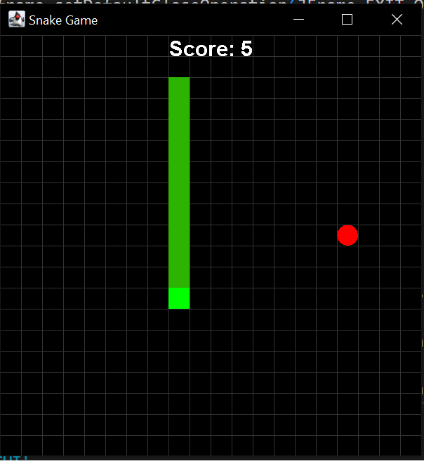

# Snake Java Project

A classic Snake game implemented in Java.

## Table of Contents
- [Overview](#overview)
- [Getting Started](#getting-started)
- [Controls](#controls)

## Overview
This project is a Java implementation of the popular Snake game. It provides a simple and intuitive gameplay experience where the player controls a snake and tries to eat apples to grow longer without colliding with the walls or its own body.

## Getting Started
To run the game locally, follow these steps:
1. Clone the repository: `git clone https://github.com/your-username/your-repo.git`
2. Compile the Java source files: `javac MyGUI.java`
3. Run the game: `java MyGUI.java`

## Controls
- Use the arrow keys (up, down, left, right) to control the snake's movement.
- Avoid colliding with walls or the snake's body.
- Eat apples to score points and grow longer.
